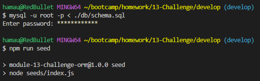

# E-commerce Back End

## Description

This project was made to practice and show my skills in building a backend for an e-commerce site. It uses the MySQL2 and Sequelize packages to connect the Express.js API to a MySQL database. It has multiple API routes to perform RESTful CRUD operations.

## Installation

- Have Nodejs installed (I used v16.18)
- Install npm dependencies
    - use 'npm install' on terminal once navigated to folder
- Have mysql installed
    - run the [schema.sql](db/schema.sql) file with your mysql shell
    - run the [index.js](./seeds/index.js) file if you wish to populate the database

## Usage

If you wish to try out this application then first you'll have to run the sql schema file to your server. Log into mysql on your terminal to access the shell then run the [file](./db/schema.sql), ex. "mysql -u root -p < ./db/schema.sql". You can then seed the database using the [index.js](./seeds/index.js) file or run 'npm run seed' in your terminal for Node to run it for you. Then you'll just have to start the server using the [server.js](./server.js) file or run 'npm start' in your terminal. Please see [video demonstration](https://drive.google.com/file/d/1fxvcbOMgK8qFuWWhQ2OFXOx2pXghO1tx/view) to see this process and testing the endpoints. 

## License

N/A
